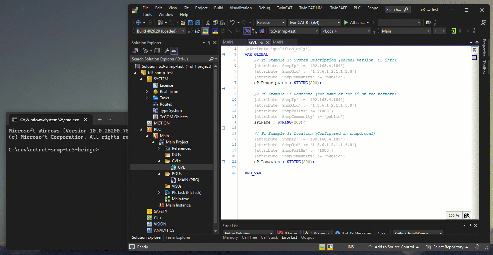

# Proof of concept creating a simple .net core application to access SNMP variables from TwinCAT 3

## Disclaimer

This guide is a personal project and not a peer-reviewed publication or sponsored document. It is provided “as is,” without any warranties—express or implied—including, but not limited to, accuracy, completeness, reliability, or suitability for any purpose. The author(s) shall not be held liable for any errors, omissions, delays, or damages arising from the use or display of this information.

All opinions expressed are solely those of the author(s) and do not necessarily represent those of any organization, employer, or other entity. Any assumptions or conclusions presented are subject to revision or rethinking at any time.

Use of this information, code, or scripts provided is at your own risk. Readers are encouraged to independently verify facts. This content does not constitute professional advice, and no client or advisory relationship is formed through its use.

## Description

Proof of concept to link two common libraries together. Lextm.SharpSnmpLib and TwinCAT.Ads. The aim was to see if a simple application could be created to read symbols from the PLC. Check to see if they have snmp attributes, and then start polling for values.

Please note, this is not production ready, but may be used as a base for ideas of what is possible.

## Screenshot



## TwinCAT Project Requirements

Add the following code to a TwinCAT project, then run the application. The example below is for reading snmp data from a raspberry pi.

```
{attribute 'qualified_only'}
VAR_GLOBAL
	// Pi Example 1: System Description (Kernel version, OS info)
    {attribute 'SnmpIp' := '192.168.4.109'}
    {attribute 'SnmpOid' := '1.3.6.1.2.1.1.1.0'}
    {attribute 'SnmpCommunity' := 'public'}
    sPiDescription : STRING(200);

    // Pi Example 2: Hostname (The name of the Pi on the network)
    {attribute 'SnmpIp' := '192.168.4.109'}
    {attribute 'SnmpOid' := '1.3.6.1.2.1.1.5.0'}
	{attribute 'SnmpPollMs' := '1000'}
    {attribute 'SnmpCommunity' := 'public'}
    sPiName : STRING(200);

    // Pi Example 3: Location (Configured in snmpd.conf)
    {attribute 'SnmpIp' := '192.168.4.109'}
    {attribute 'SnmpOid' := '1.3.6.1.2.1.1.6.0'}
	 {attribute 'SnmpPollMs' := '1000'}
    {attribute 'SnmpCommunity' := 'public'}
    sPiLocation : STRING(200);
END_VAR
```

## Running the application

```bash
# dotnet run -- <AmsNetId> <Port>
dotnet run -- 127.0.0.1.1.1 851
```

## Setting up a test Raspberry Pi

1. Installation

   ```bash
   sudo apt update
   sudo apt install snmp snmpd
   ```

2. Setup

   Edit

   ```bash
   sudo nano /etc/snmp/snmpd.conf
   ```

   Minimal example (SNMPv2c)

   ```nginx
   agentAddress udp:161
   rocommunity public
   sysLocation "Control Cabinet"
   sysContact "admin@example.com"
   ```

3. Restart

   ```bash
   sudo systemctl restart snmpd
   ```

## Deployment to Debian

To build a single executable that runs on Linux without needing .NET installed:

1. Run the publish command:
   ```bash
   dotnet publish -r linux-x64 -c Release --self-contained true -p:PublishSingleFile=true
   ```

## Deployment to Windows

To create a standalone executable that doesn't require a .NET installation:

1. Open a terminal in the project folder.
2. Run the following command:
   ```bash
   dotnet publish -r win-x64 -c Release --self-contained true -p:PublishSingleFile=true -p:IncludeNativeLibrariesForSelfExtract=true
   ```
